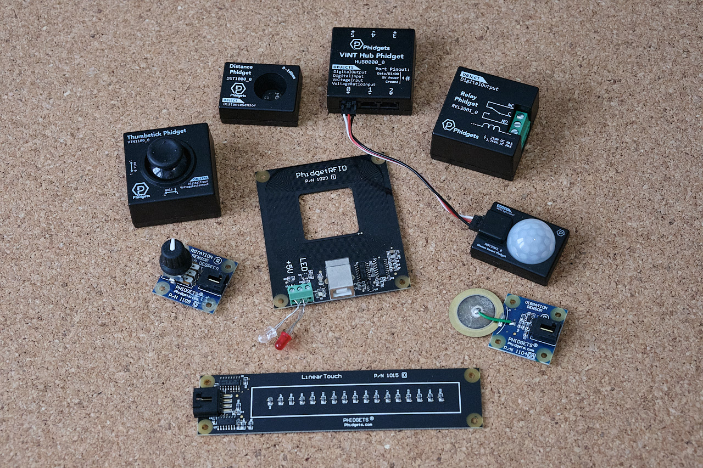
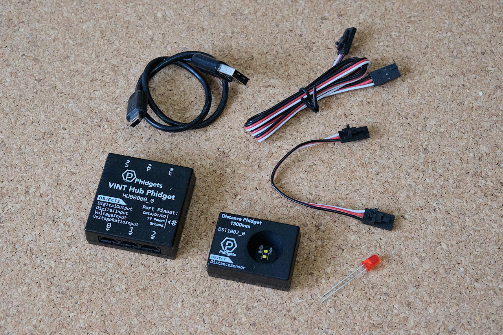
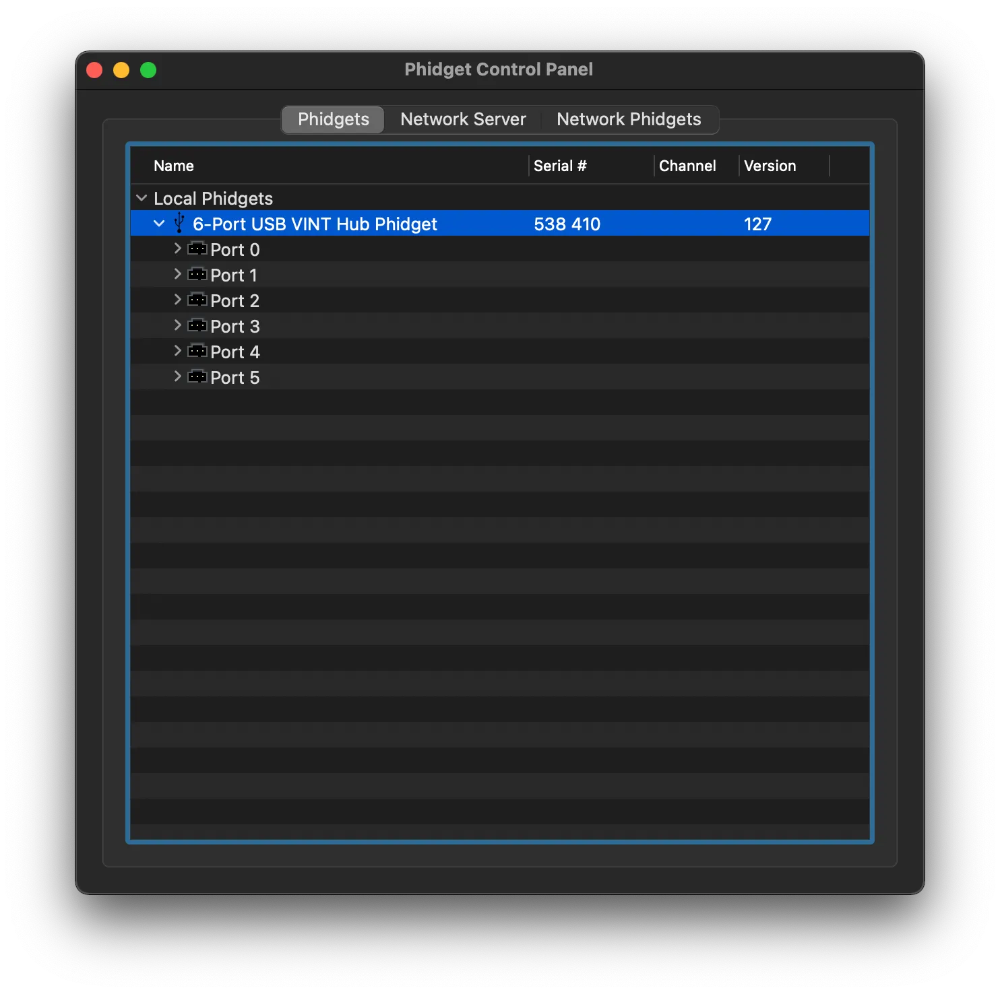
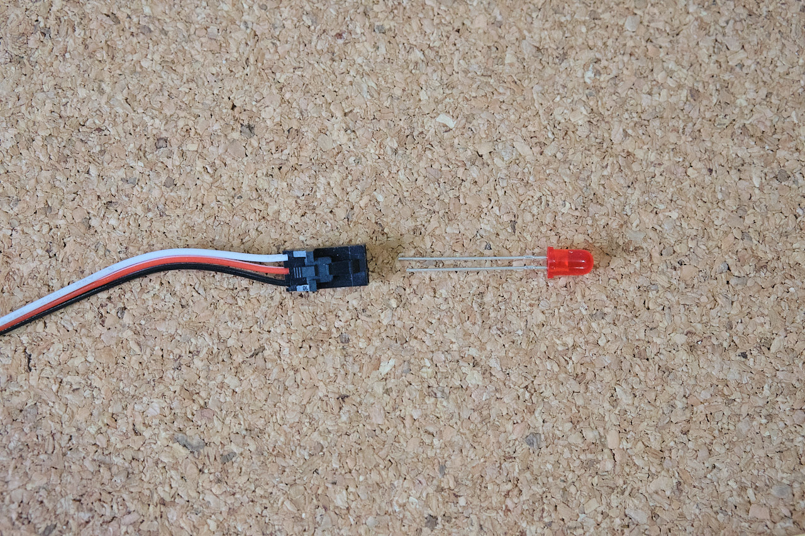
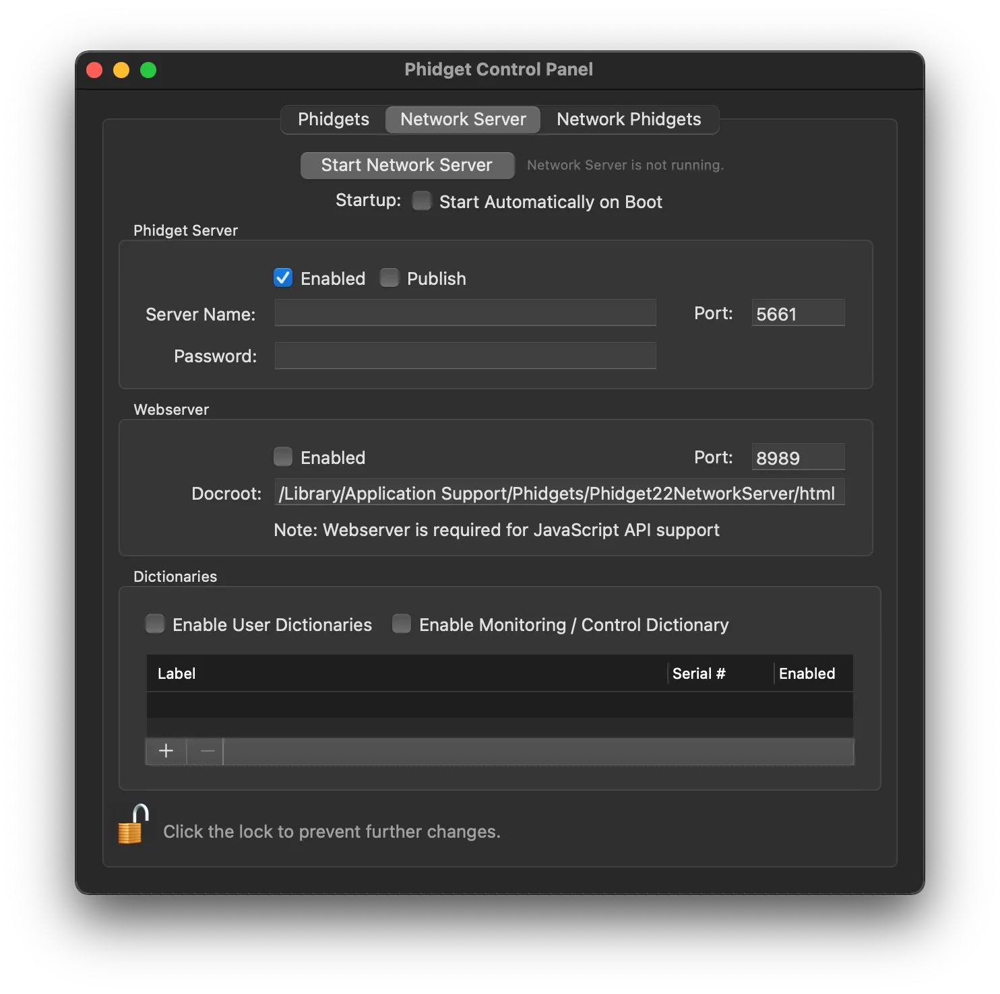
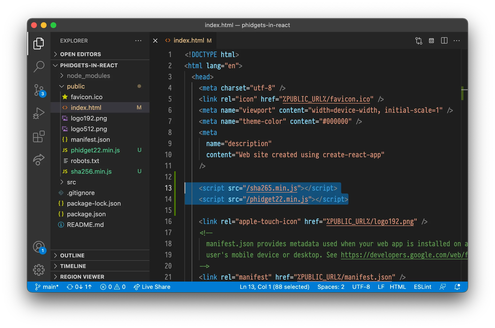

+++
title = 'Using Phidgets with React'
description = 'Phidgets is a system electronic sensors and actuators. Learn how to use it with React!'
featured = true
+++
# Using Phidgets with React

14. November 2022

### Phidgets is a system for sensors, input devices and controllers of things like LED or motors. In this tutorial I‘ll explain gotchas and generally how to use it with React.

For the impatient: the gotchas you need to be aware of is:

1. Use the JavaScript library for browsers, *not* the NPM one.
2. Use hooks to interact with the Phidgets library, as it’s very OOP oriented.
3. Remember to clean up (close phidgets and connections) when a React component is deattached.

You can also check out [this example repo](https://github.com/torb-xyz/phidgets-in-react).

## What is Phidgets?
[Phidgets](https://www.phidgets.com) is a system for easily using physical sensors or actuators in your applications. The name is a riff on the 90s word for GUI components: 'widgets' combined with 'physical'. A *Phidget* can be an input like a [slider](https://www.phidgets.com/?tier=3&catid=104&pcid=84&prodid=83) or [distance sensor](https://www.phidgets.com/?tier=3&catid=5&pcid=3&prodid=960). It can also be an output, such as a [motor](https://www.phidgets.com/docs/Motor_Selection_Guide), [relay](https://www.phidgets.com/?tier=3&catid=46&pcid=39&prodid=1142) or [LED controllers](https://www.phidgets.com/?tier=3&catid=99&pcid=79&prodid=964).

All this might make you think of Arduino. Arduino is similar in that it's an electronics platforms, but Phidgets is different in that it's specifically made to be used with computers. It's not a standalone microcontroller like Arduino. You also program them in a much easier and more high level way compared to Arduino. Arduino has it's place, but if all you want is some sensor input input or physical controls in your apps, then Phidgets is something you should consider. Note: I’m not affiliated with Phidgets, I just like their stuff.

## Hardware

Before we get to the React part we have to get ready on the Phidgets hardware side of things. In this tutorial I’m going make a small project that uses a distance sensor and  a couple of LED lights to give feedback based on distance. Even if you’re using different Phidgets for different purposes this should give you a pretty good idea of how to use them with React.

In addition to a computer, to follow this tutorial you’ll need:

- [VINT Hub Phidget](https://www.phidgets.com/?tier=3&catid=2&pcid=1&prodid=643)
- [Distance Phidget](https://www.phidgets.com/?tier=3&catid=5&pcid=3&prodid=960)
- [2 Phidget Cables](https://www.phidgets.com/?tier=3&catid=30&pcid=26&prodid=152)
- An USB Mini-B connector
- 1x White LED

## OS and driver setup

Assuming you have some Phidget hardware, to get started you need to install the [drivers](https://phidgets.com/docs/Phidgets_Drivers). *After* you’ve installed your drivers connect your VINT Hub Phidget and open the Phidget Control Panel. Under Local Phidgets you should see *6-Port USB VINT Hub Phidget*.

Connecting the Distance Phidget to port 0 should make it appear in the Phidget Control Panel under the corresonding port. Double clicking on it should open a dialog with more information about it. It will also open Error Event Log filled with ‘Sensor value is ouside the valid range for this sensor.’ but you can safely ignore that.

Moving your hand up and down should let you see the Distance field in the dialog change as you the distance between your hand and the sensor changes.

Connect the LED light to the phidget cable with so that the long end goes in the input from the white cable and the short end goes into the input from the black part of the cable like so:

After connect the other end to port 2 on the VINT Hub. Now you go open Port 2 in the Phidget Control Panel. You’ll notice that it won’t come up with any automatic suggestions like it did for the Distance Phidget. This is because the LED light is an standard electronic component and not an specific Phidget that can connect from Phidgets themselves. We’re going to turn the light on and off digitally so we can double click on the Hub Port - Digital Output Mode. Doing this should give you a dialog. If you toggle the ON/OFF button in the dialog this should also toggle the light.

## Adding Phidgets to React

Now that we’ve got everything set up and we know it works hardware wise we can look at getting it to do something in an React app! This part assumes you've already set up a React app using *create-react-app* as decribed in [this guide on the React docs](https://beta.reactjs.org/learn/start-a-new-react-project) and that you have the React development server running.

To use Phidget with a browser application you need to turn on the network server. You do this in the Network Server tab.

Considering that there are several phidget related packages on NPM, including phidget22 which is the offical NPM library from Phidgets you might think that you should use one of those. However for JavaScript apps running in the browser like React *you cannot use any of the NPM packages!* These NPM packages are designed to be run in a server-side Node app.

There are two official JavaScript libraries for phidget. The one previously mentioned for usage in server, and one made specifically for JavaScript that runs in the browser. We have to use the one for browsers.

Download the JavaScript Phidgets library on [JavaScript language page](https://www.phidgets.com/docs/Language_-_JavaScript). On that page you can also find the official documentation and other code examples (though, none for React specifically).

After downloading the [Phidgets JavaScript Library](https://www.phidgets.com/downloads/phidget22/libraries/any/Phidget22JavaScript.zip) place the *phidget22.min.js* and *sha265.min.js* in the public folder in your React app. After this add script references to these in index.html in the public folder. Now you’ve made the Phidget JavaScript library available for use in your React app and it will always be available in your global scope.





## Basics and distance sensor

To make it a bit easier to see what we’re doing remove most of App.js so it looks like this:


/* eslint-disable no-undef */
// We need to disable no-undef eslint rule since
// eslint doesn't know about phidgets

import { useEffect } from 'react';
import './App.css';

function App() {
  return (
    

      
    

  );
}

export default App;


Since phidget is an object-oriented library that doesn’t work with the functional-reactive nature of React by default we have to use the `useEffect` hook. Use an empty list with the `useEffect` so it only updates once.

Let’s add `useEffect` alongside with a phidget connection config and then connect to the phidget drivers server.


useEffect(() => {
  const phidgetConnection = new phidget22.Connection({
    hostname: 'localhost',
    port: 8989,
  });

  phidgetConnection.connect().then(() => {
    console.log('Connected to Phidgets')
  }).catch(function(err) {
    console.error('Error during connect: ' + err);
  });
}, []);


Run this and open your React app you should see `Connected to Phidgets` in the developer tools console in your browser. If you get an error check to make sure the Phidget Network Server is running.

Now that we’ve managed to connect to Phidgets server let’s try to get some data from our distance sensor. Let’s set up the distance sensor object and print out values to console. We set the the distance sensor object inside the connection promise then block. We add a new object, set up an event listener by assigning it to `onDistanceChange` (instead of using `addEventListener` as is typical in JavaScript), and then we open the sensor. Your *App.js* should then look like this:


const distanceSensor = new phidget22.DistanceSensor();
distanceSensor.onDistanceChange = function(distance) {
  console.log('Distance: ' + distance);
};

distanceSensor.open().catch(function(err) {
  console.error('Error opening sensor: ' + err)
});


 You should now get distance readings in console from the distance sensor.

## Showing distance sensor in React

Now that we’ve confirmed that we’re able to get data from the distance sensor let’s add some state-variables and HTML to make it visible. Your App.js should now look like this:


/* eslint-disable no-undef */
// We need to disable no-undef eslint rule since
// eslint doesn't know about phidgets

import { useEffect, useState } from 'react';
import './App.css';

function App() {
  const [distance, setDistance] = useState(-1);

  useEffect(() => {
    const phidgetConnection = new phidget22.Connection({
      hostname: 'localhost',
      port: 8989,
    });

    phidgetConnection.connect().then(() => {
      console.log('Connected to Phidgets')

      const distanceSensor = new phidget22.DistanceSensor();
      distanceSensor.onDistanceChange = function(distance) {
        setDistance(distance);
      };

      distanceSensor.open().catch(function(err) {
        console.error('Error opening sensor: ' + err)
      });
    }).catch(function(err) {
      console.error('Error during connect: ' + err);
    }) ;
  }, [])

  return (
    

      
Distance: {distance}

    

  );
}

export default App;


The app in action:

## Controlling the light

To control the lights we use a `DigitalOutput` object and then keep it stored in a reference so we can manipulate it from a button click event for example. We add the reference with `const ledRef = useRef();`. The setup of the led looks like this and should be inside the connection just like the distance sensor.


const led = new phidget22.DigitalOutput();
led.setHubPort(2);
led.setIsHubPortDevice(true);

led.open().then(() => {
  ledRef.current = led;
}).catch(err => {
  console.error('Error opening LED: ' + err);
});


When setting it up we need to also set the hub port an that it’s a hub port device. This is because the LED is not a smart VINT device but a simple device so we have to specify that.

Now we just add a couple of buttons with event handlers that sets the state.


<button onClick={() => {
  ledRef.current.setState(true);
}}>
  On
</button>

<button onClick={() => {
  ledRef.current.setState(false);
}}>
  Off
</button>


Now you can turn on and off the light using the buttons in your React app and get distance input in your React app!

## Cleaning up after yourself

While the code we have so far does work in our very simple situation we're not quite following best practice. You may be familiar with cleaning up after yourself when using useEffects, maybe you added some event handlers and then you make sure to remove them after so avoid problems.

You need to do the same with Phidgets. Havin several connections or phidget channels open can cause problems. This is espescially relevant if you're using Phidgets in several different components.

Cleanup for when a component is removed we by returning a function in useEffect and doing the cleanup inside there. We do the cleanup itself by closing the sensor, led and connection. It's important that we do close the sensor and led *before* the connection.

To do this we keep a list of our devices by declaring an array we store them by writing  `const phidgetDevices = [];` inside our useEffect block. Inside each of the `then(…` blocks we then add that device to the list (so we only add the ones that successfully open). After that your entire useEffect block should look like this:


useEffect(() => {
  const phidgetConnection = new phidget22.Connection({
    hostname: 'localhost',
    port: 8989,
  });

  const phidgetDevices = [];

  phidgetConnection.connect().then(() => {
    console.log('Connected to Phidgets')

    const distanceSensor = new phidget22.DistanceSensor();
    distanceSensor.onDistanceChange = function(distance) {
      setDistance(distance);
    };

    distanceSensor.open().then(() => {
      phidgetDevices.push(distanceSensor);
    }).catch(err => {
      console.error('Error opening sensor: ' + err)
    });

    const led = new phidget22.DigitalOutput();
    led.setHubPort(2);
    led.setIsHubPortDevice(true);

    led.open().then(() => {
      ledRef.current = led;
      phidgetDevices.push(led);
    }).catch(err => {
      console.error('Error opening LED: ' + err);
    });

  }).catch(err => {
    console.error('Error during connect: ' + err);
  }) ;

  return () => {
    phidgetDevices.forEach(pd => pd.close());
    phidgetConnection.close();
  };
}, [])


## That's it!

Using Phidgets can seem a bit tricky if haven't done it before, but once you know it's not too bad. Having the option to easily use sensors and actuators through Phidgets with the functional style UI like React is very handy!

You can view the [source code in this repo](https://github.com/torb-xyz/phidgets-in-react/tree/main).