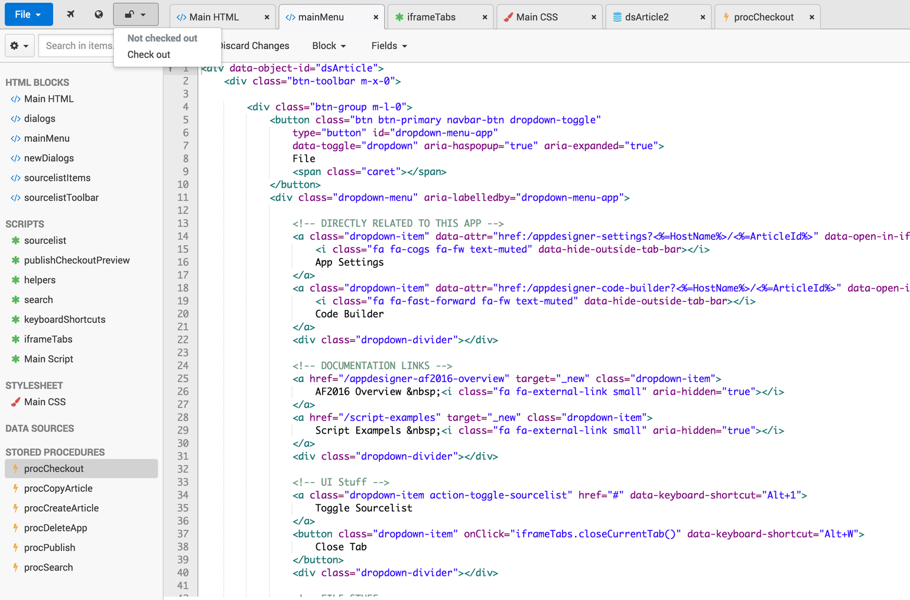
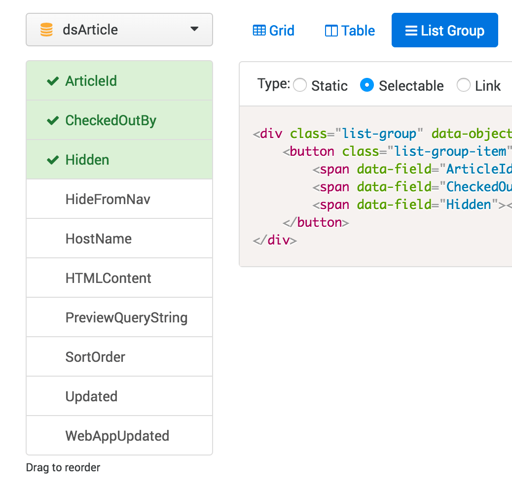

+++
title = 'Web-based editor'
slug = 'omega-web-based-editor'
weight = 15
description = 'Browser-based editor and tooling for an internal web framework.'
+++
# Omega 365's web-based editor

### Front-end Development, HTML/CSS, JavaScript, jQuery

Large parts of [Omega 365](https://www.omega365.com)'s developer tools are entirely web based. I worked on the UI design and front-end code for the editor and IDE used to create user facing webapps and websites. This was also used as a basis for other tools such as a SQL management tool. I also created tools for autogenerating code used both as a learning tool and for speeding up development.

