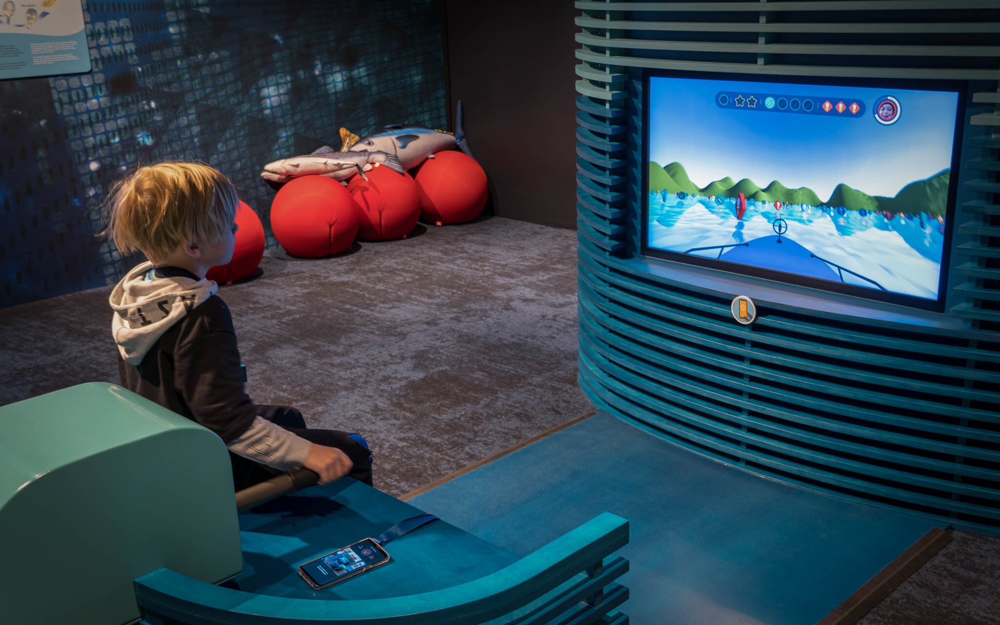

+++
title = "House of Salmon"
slug = 'house-of-salmon'
weight = 15
description = "Interactive installations to learn about salmon farming"
featured = true
+++
# House of Salmon

### Interaction Design, Visual Design, Front-End Development, Game Development, Unity, C#, React, TypeScript, Android, Java, Capacitor, Craft CMS, Phidgets

[House of Salmon](https://www.laksenshus.no/?lang=en) is a visitation for aquaculture. Here students and other can learn about how salmon farming works and it‘s history.

While working for [Back](https://back.no/laksens-hus-1) I designed and programmed experiences for several interactive installations and smartphone.

This included a phone app that allows participants to register points, activate various installations and play mini games connected to various installations. I worked on software for several installations, including a 3D game where you drive a boat to gather tokens tokens representing food for salmon.

*‌Photo credit: Emile Dahlman/Lars-Petter Garen*