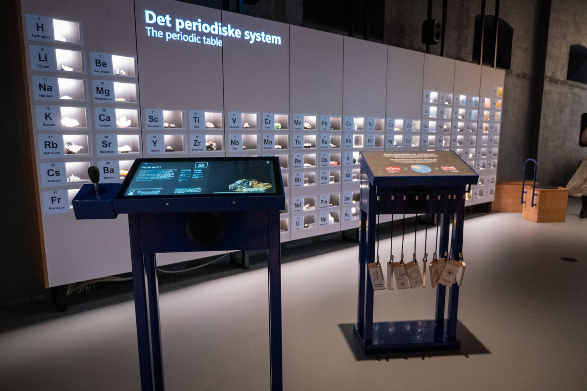
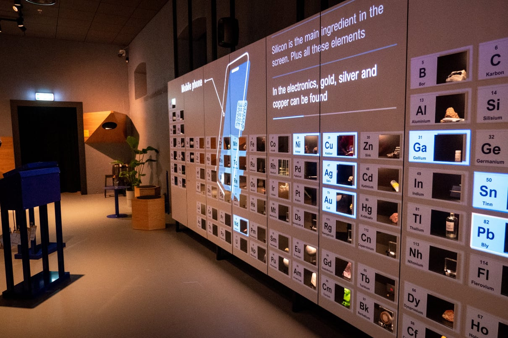
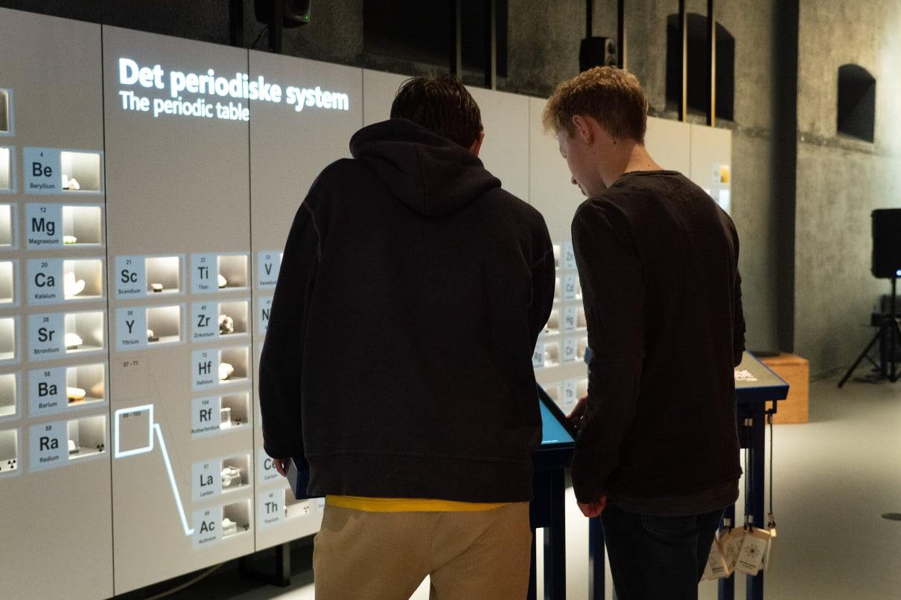

+++
title = 'Periodic System Wall'
description = 'Installation explaining the elements in the periodic system.'
slug = 'periodic-wall'
weight = 17
+++
# Periodic System Wall

### Interaction Design, UI Design, Front-End Development, React, TypeScript, Craft CMS, Phidgets

Together with colleagues in [Back](https://back.no) I worked on a wall of the periodic table for [Norwegian Mining Museum](https://norskbergverksmuseum.no/english). This installation allowed visitors to learn about specific elements or groups of them.

