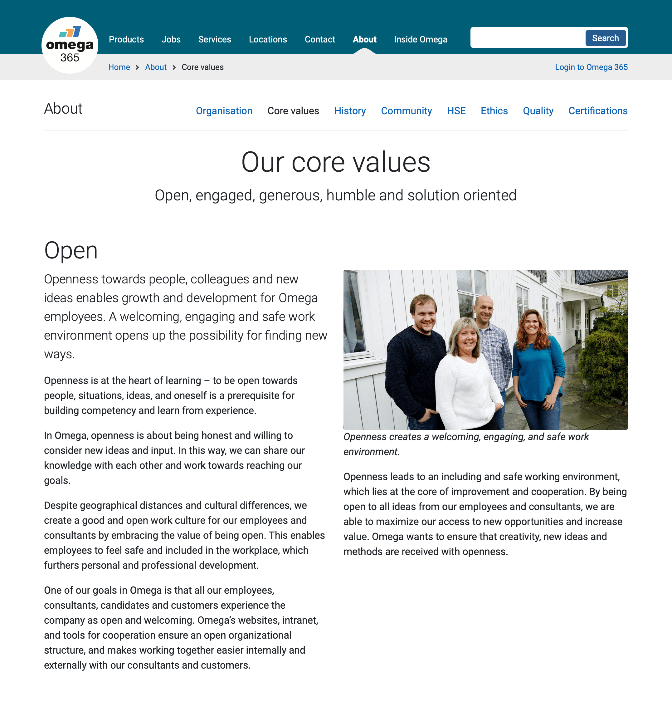

+++
title = "Omega 365"
slug = 'omega-365-webpage'
description = "Corporate homepage of the Omega 365 group."
weight = 20
+++
# Omega 365 homepage

### Information Architecture, Web Design, Front-End Development, Bootstrap 5, HTML/CSS, JavaScript, C#, Appframe

I worked on a comprehensive redesign of Omega 365's [corporate homepage](https://www.omega365.com), a company with over 1,500 employees from around the world. Here I worked on everything from the information architecture to concrete implementation. I also coordinated with developers on improvements to Omega's proprietary content management system.

