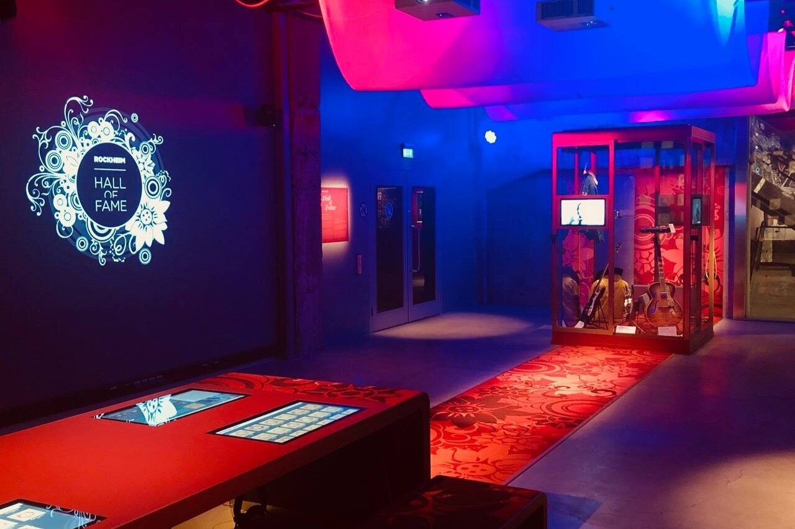
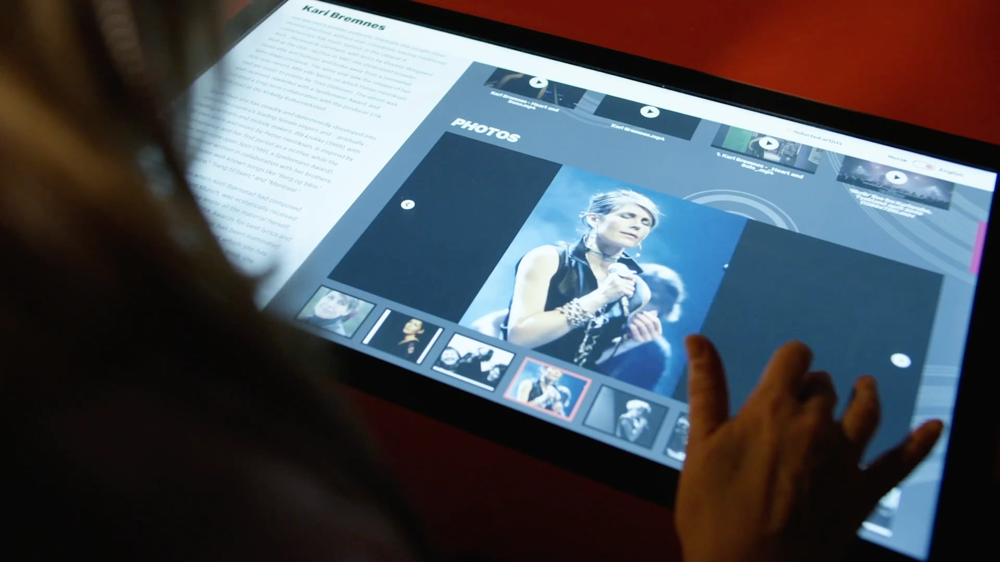
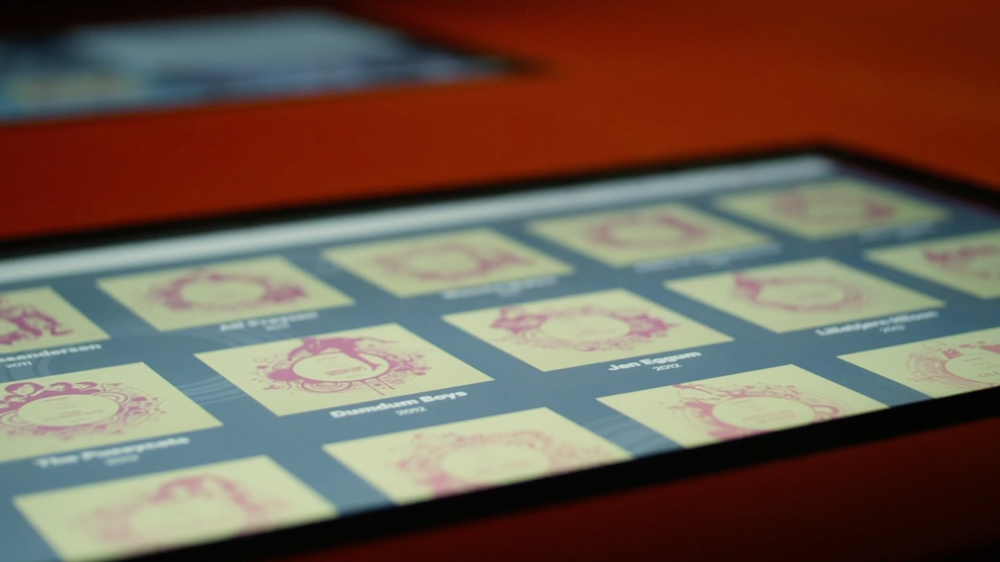

+++
title = 'Rockheim Hall of Fame'
slug = 'rockheim-hall-of-fame'
weight = 20
description = 'Interactive screen for Rockheim music museum.'
+++
# Rockheim Hall of Fame

### User Interface Design, Information Architecture, Visual Design

At [Back](https://back.no/new-project-1) I designed the touch screen experience for [Rockheim Hall of Fame](https://rockheim.no/en/hall-of-fame-exhibition). In this screen visitors are able to learn about the inductees and their place in the history of Norwegian popular music.

