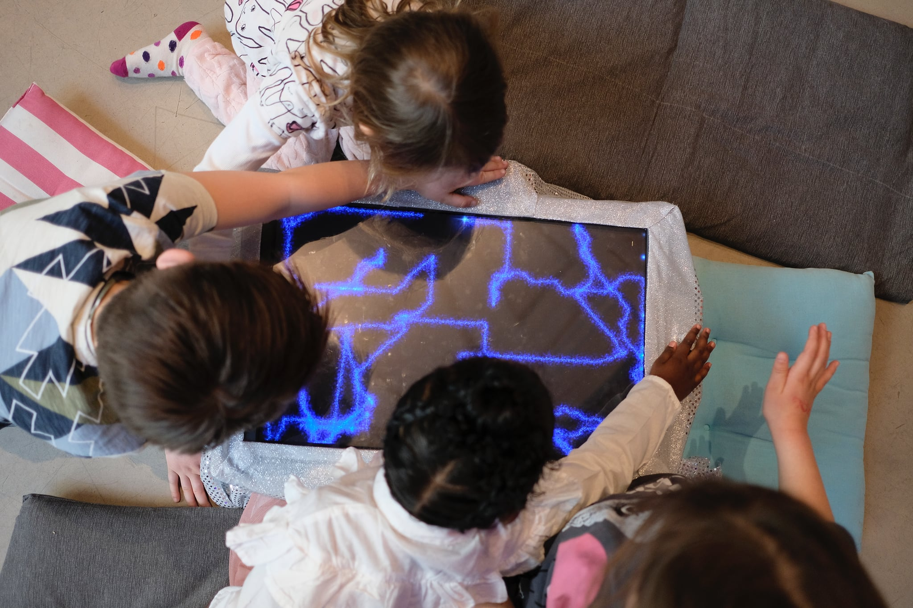

+++
title = 'Magical drawing installation'
slug = 'magical-drawing-installation'
weight = 22
+++

# Magical drawing installation for kids

### Creative Coding, Prototyping, C++, openFrameworks, Processing, Arduino, Grove System

While studying at [University of Oslo](https://www.uio.no/english/) I collaborated on a project to prototype interactive installations for [Oslo Children‘s Museum](https://oslobarnemuseum.org/en/). Together with my group I iterated on ideas, eventually landing on an experience where kids could draw on magical screen alone or with others. When several used it together the installation implicitly encouraged collaboration.

<video src="video.mp4" autoplay loop muted width=100% height="auto" />

This drawing machine controlled by holding hands over distance sensors by ”pushing” in the pair the direction you want the virtual pen to go. Over several iterations we also dressed it up in a magical aesthetic to appeal to kids sense of wonder. I did the [programming](https://github.com/torb-xyz/IN1060-prototyping) for these prototypes.

