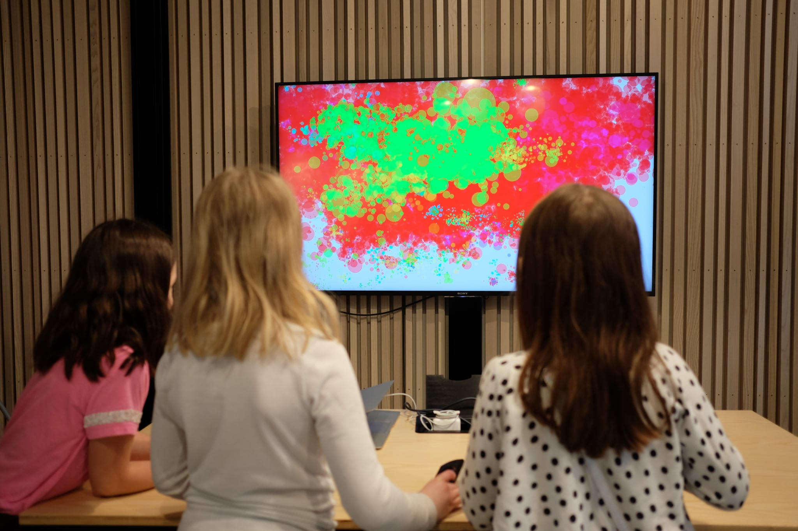

+++
title = 'Sound Painter'
slug = 'sound-painter'
description = 'Splash virtual paint through the tone of your voice.'
weight = 26
+++

# Sound Painter

### Creative Technology, Prototyping, Processing

For [Oslo Children‘s Museum](https://oslobarnemuseum.org/en/) in co-operation with [Nora Tessem](https://www.linkedin.com/in/nora-tessem/) I created a prototype for an interactive installations that let‘s people make noise to throw virtual paint at a screen. The colour of the paint is based on the pitch of the sound and the intensity matches the volume.

<video src="video.mp4" muted autoplay playsinline loop width=100% height="auto" />

Kids are often expected to sit and be quiet. We noticed that many of them found it especially fun that they where *supposed to* make a lot of noise.